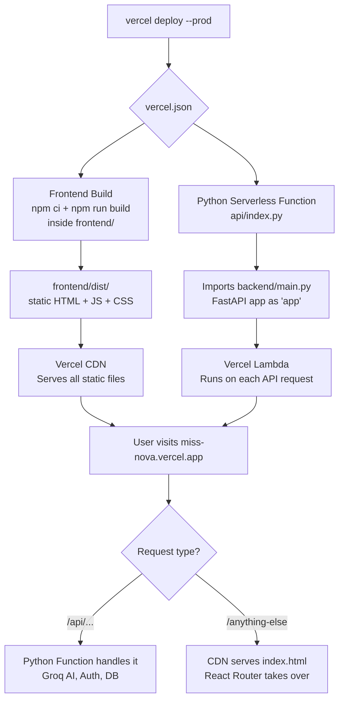
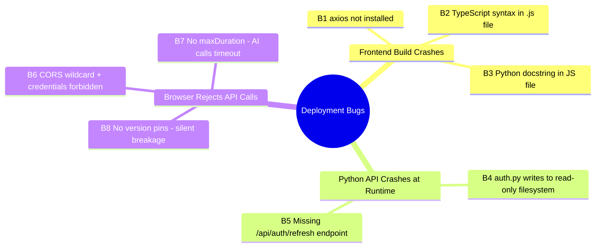
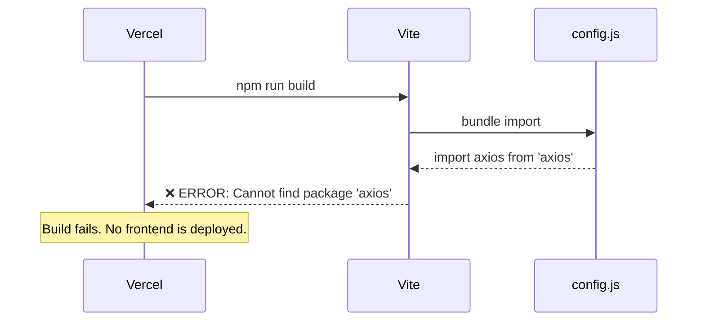
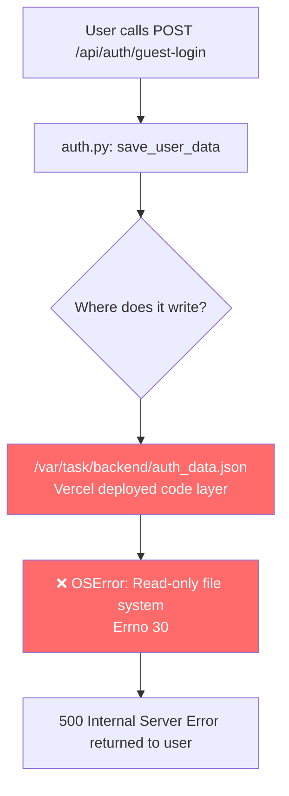
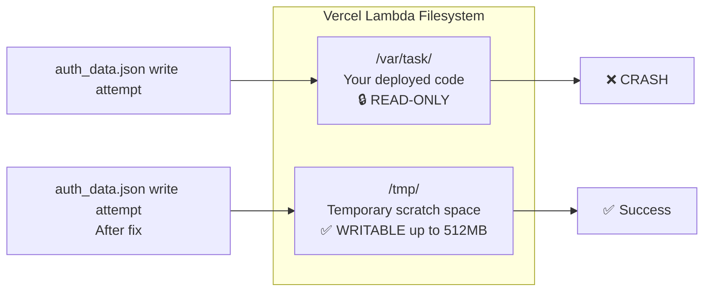
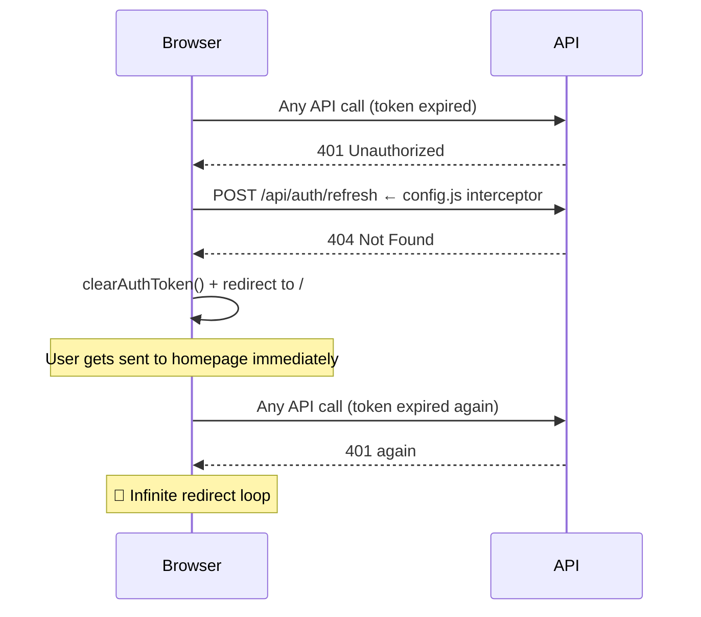
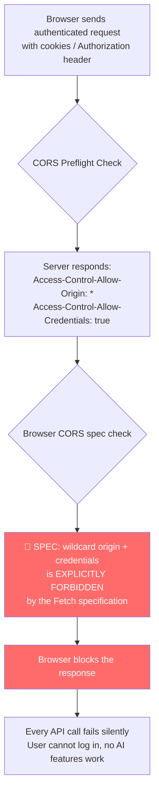
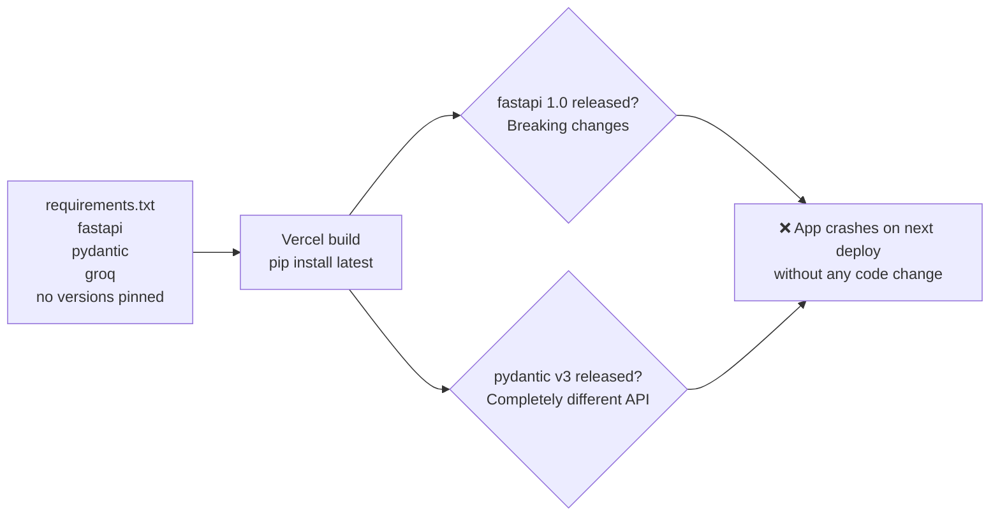
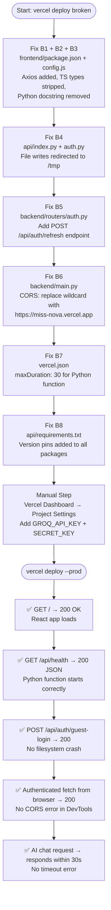

# MissNova — Vercel Deployment Guide

> What is the project, what broke, why it broke, and exactly how each problem is fixed.

---

## 1. What Is This Project?

MissNova is a full-stack AI communication coaching app. It has two completely separate codebases that must **both** work on Vercel.

```
MissNova/
├── frontend/          ← React 19 + Vite + TailwindCSS  (UI)
├── backend/           ← FastAPI + SQLite  (business logic)
├── api/
│   ├── index.py       ← Vercel's Python entry point (bridges → backend/)
│   └── requirements.txt
└── vercel.json        ← Deployment configuration
```

---

## 2. How Vercel Deploys This App



---

## 3. The Problems — Full List

There are **8 bugs** that prevent the app from working correctly. They fall into 3 categories:



---

## 4. Problem Deep Dives + Fixes

---

### B1 — `axios` is Not Installed (Build Crash)

**Where:** `frontend/src/api/config.js`

**What happens:**



**Root cause:** `axios` is used in `frontend/src/api/config.js` but was never added to `frontend/package.json`.

**Fix:** Add `"axios": "^1.7.9"` to `dependencies` in `frontend/package.json`.

---

### B2 + B3 — TypeScript Syntax and Python Docstring in a `.js` File (Build Crash)

**Where:** `frontend/src/api/config.js`

**What happens:**

```mermaid
flowchart LR
    A[config.js] --> B{Vite esbuild parser}
    B --> C["Line 1: triple-quoted string\n\"\"\"Axios API Configuration...\"\"\"\n❌ SyntaxError: Invalid JS"]
    B --> D["Line 20: TS type annotation\nlet accessToken: string | null\n❌ Cannot parse .js as TypeScript"]
    C --> E[Build fails immediately]
    D --> E
```

**Root cause:**

- The file starts with `"""..."""` — that is a Python docstring, completely invalid JavaScript
- Throughout the file, TypeScript type annotations are used: `string | null`, `?: string`, `Promise<string | null>`, `: any` — Vite does not treat `.js` files as TypeScript

**Fix:**

- Remove the `"""..."""` block at the top, replace with a standard JS comment `// ...`
- Strip all TypeScript annotations from the file, keeping identical logic

---

### B4 — `auth.py` Writes to the Read-Only Filesystem (Runtime Crash)

**Where:** `backend/routers/auth.py`

**What happens:**



**Why this happens on Vercel:**



**Fix:**

1. In `api/index.py`, add `os.environ.setdefault("AUTH_DATA_FILE", "/tmp/auth_data.json")` before importing backend
2. In `backend/routers/auth.py`, change the hardcoded path to read from `AUTH_DATA_FILE` env var

---

### B5 — `/api/auth/refresh` Endpoint Does Not Exist (Redirect Loop)

**Where:** `frontend/src/api/config.js` calls it; `backend/routers/auth.py` never defines it

**What happens when a token expires:**



**Fix:** Add a `POST /api/auth/refresh` route to `backend/routers/auth.py` that validates the current token and issues a fresh one (or returns 401 if invalid).

---

### B6 — CORS Wildcard + Credentials = Browser Blocks All Auth (Silent Failure)

**Where:** `backend/main.py`

**The broken config:**

```python
allow_origins=["*"],         # wildcard
allow_credentials=True,      # credentials
```

**Why browsers reject this:**



**Fix:** Change `allow_origins=["*"]` to `allow_origins=["https://miss-nova.vercel.app"]` in `backend/main.py`.

---

### B7 — AI Calls Timeout (30s Groq Requests Hit 10s Default Limit)

**Where:** `vercel.json` — missing `functions.maxDuration`

**What happens:**

```mermaid
gantt
    title Request Timeline (AI scenario chat)
    dateFormat  s
    axisFormat  %Ss

    section Without fix (default 10s)
    Vercel default timeout :crit, 0, 10s
    Groq API call         :active, 0, 25s
    Timeout kills lambda  :milestone, 10s, 0s

    section After fix (maxDuration 30)
    Extended timeout      :done, 0, 30s
    Groq API call         :active, 0, 25s
    Response returned ok  :milestone, 25s, 0s
```

**Fix:** Add to `vercel.json`:

```json
"functions": {
  "api/index.py": { "maxDuration": 30 }
}
```

---

### B8 — No Version Pins = Silent Breakage on Next Deploy

**Where:** `api/requirements.txt`

**The problem:**



**Fix:** Pin all packages in `api/requirements.txt`:

```
fastapi>=0.115,<1
pydantic>=2,<3
sqlalchemy>=2,<3
groq>=0.11,<1
python-jose[cryptography]>=3.3,<4
passlib[argon2]>=1.7,<2
```

---

## 5. Complete Fix Flow



---

## 6. Environment Variables (Manual Step)

These **cannot** be committed to code. They must be added in the **Vercel Dashboard → Project Settings → Environment Variables**.

| Variable       | Required | Description                                                                      |
| -------------- | -------- | -------------------------------------------------------------------------------- |
| `GROQ_API_KEY` | ✅ Yes   | All AI features (chat, scenario, evaluation) will return 500 without this        |
| `SECRET_KEY`   | ✅ Yes   | Used to sign JWT auth tokens. Use a long random string                           |
| `DATABASE_URL` | Optional | Defaults to SQLite in `/tmp`. Set a Postgres URL (e.g. Neon) for persistent data |

> **Note on SQLite + Vercel:** The default SQLite database lives in `/tmp` — it is wiped on every cold start (typically after ~1 hour of inactivity). User accounts will not persist between sessions. For persistent logins, set `DATABASE_URL` to a free [Neon](https://neon.tech) Postgres database. No code changes are needed — SQLAlchemy handles both automatically.

---

## 7. Current Status of Each File

| File                         | Status     | What needs fixing                                            |
| ---------------------------- | ---------- | ------------------------------------------------------------ |
| `vercel.json`                | ⚠️ Partial | Add `functions.maxDuration: 30`                              |
| `api/index.py`               | ✅ Fixed   | `/tmp` redirects already applied for DB and `USERS_DATA_DIR` |
| `backend/main.py`            | ⚠️ Partial | `USERS_DATA_DIR` fixed; CORS still uses wildcard             |
| `backend/routers/auth.py`    | ❌ Broken  | Writes to read-only path; no `/refresh` route                |
| `frontend/src/api/config.js` | ❌ Broken  | Python docstring at top; TypeScript syntax; `axios` missing  |
| `frontend/package.json`      | ❌ Broken  | `axios` dependency not listed                                |
| `api/requirements.txt`       | ⚠️ Risky   | No version pins on any package                               |
