# Miss Nova - Communication Learning Platform
## Complete Technical Documentation

---

## 📋 Table of Contents
1. [Project Overview](#project-overview)
2. [System Architecture](#system-architecture)
3. [Backend Architecture](#backend-architecture)
4. [Frontend Architecture](#frontend-architecture)
5. [Data Flow & Interaction Patterns](#data-flow--interaction-patterns)
6. [API Endpoints Reference](#api-endpoints-reference)
7. [Component Documentation](#component-documentation)
8. [Gamification System](#gamification-system)
9. [AI Integration](#ai-integration)
10. [File Structure](#file-structure)

---

## 🎯 Project Overview

**Miss Nova** is a full-stack AI-powered English communication learning platform that provides:
- Real-time voice practice with speech recognition
- Scenario-based roleplay for professional & social situations
- Pronunciation training with tongue twisters
- Daily vocabulary lessons with AI evaluation
- Gamified progress tracking with XP, levels, streaks, and badges

### Tech Stack
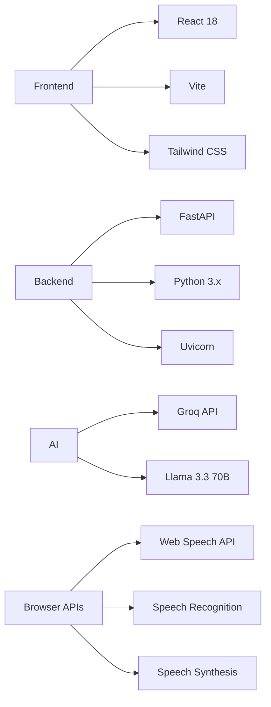

---

## 🏗️ System Architecture

### High-Level Architecture

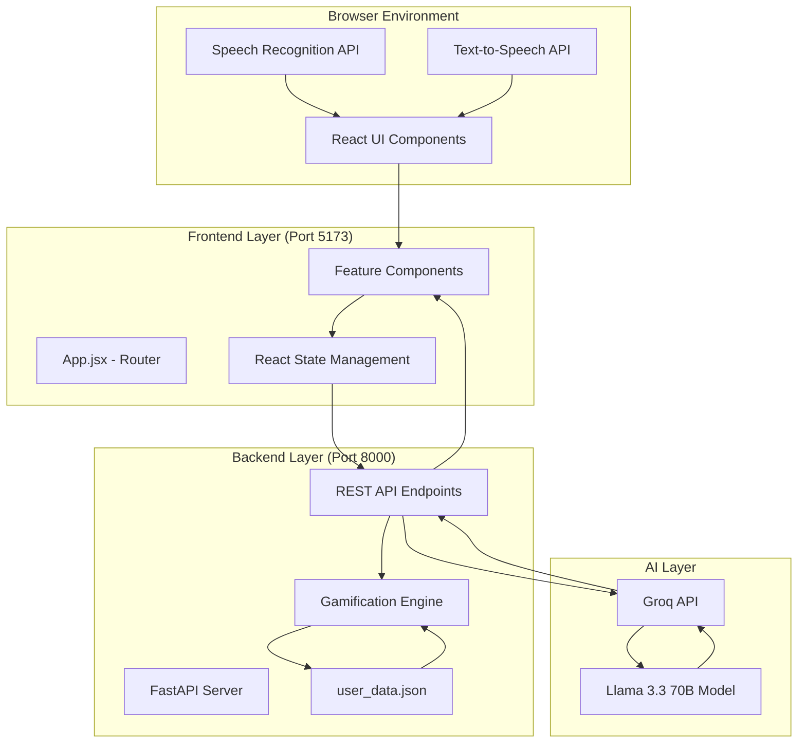

### Request-Response Flow

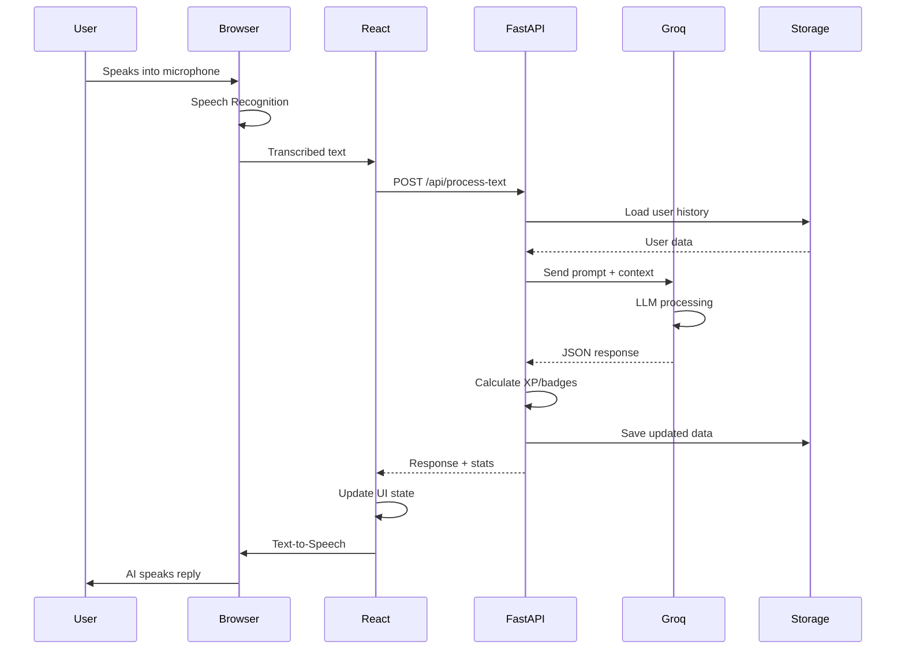

---

## 🔧 Backend Architecture

### Main Components (`backend/main.py`)

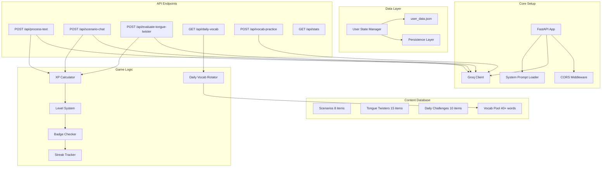

### Data Persistence Model

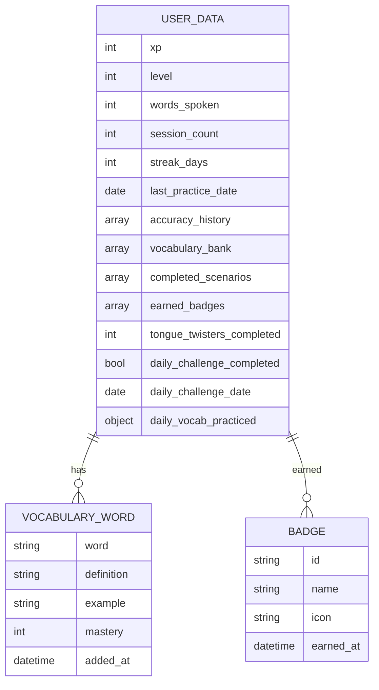

### Gamification Engine Logic

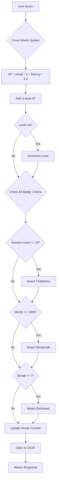

---

## 🎨 Frontend Architecture

### Component Hierarchy

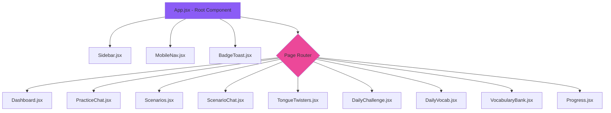

### State Management Flow

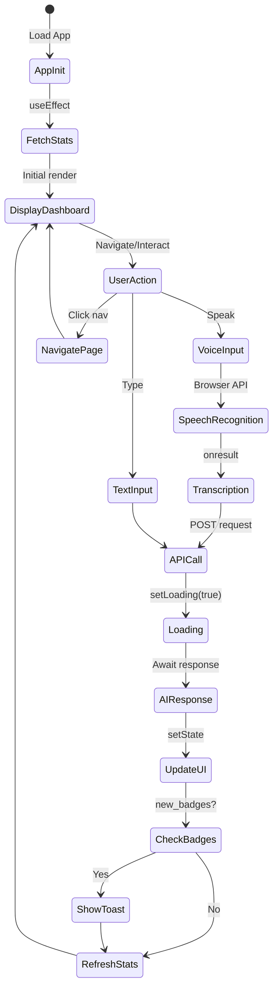

### CSS Design System

```mermaid
graph LR
    subgraph Colors["CSS Variables"]
        A[--bg-primary: #0a0a1a]
        B[--bg-secondary: #111127]
        C[--bg-card: rgba 255,255,255,0.02]
        D[--text-primary: #ffffff]
        E[--text-secondary: #cbd5e1]
    end
    
    subgraph Effects["Visual Effects"]
        F[Glassmorphism]
        G[Backdrop Blur]
        H[Box Shadows]
        I[Gradients]
    end
    
    subgraph Animations["Keyframe Animations"]
        J[pulse-ring]
        K[shimmer]
        L[toast-slide-in]
        M[page-enter]
    end
    
    Colors --> Effects
    Effects --> Animations
```

---

## 🔄 Data Flow & Interaction Patterns

### Voice Practice Flow

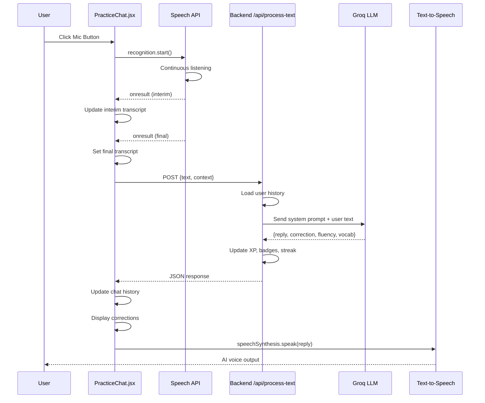

### Scenario Practice Flow

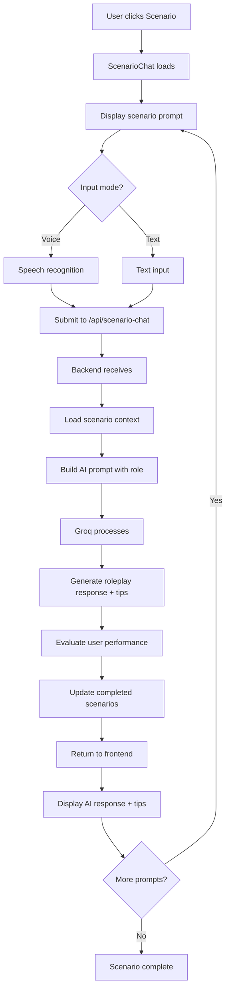

### Daily Vocabulary Rotation

```mermaid
flowchart LR
    A["User visits /daily-vocab"] --> B["GET /api/daily-vocab"]
    B --> C{Check date}
    C -->|Same day| D[Return cached selection]
    C -->|New day| E[Generate new selection]
    
    E --> F[Create MD5 hash from date]
    F --> G[Use as random seed]
    G --> H[Shuffle word pool]
    H --> I[Pick 2 from each category]
    I --> J[Fill to 12 words total]
    J --> K[Mark practiced words]
    K --> L[Return to frontend]
    
    L --> M[Display word cards]
    M --> N{User clicks word}
    N --> O[Show detail view]
    O --> P[User writes sentence]
    P --> Q["POST /api/vocab-practice"]
    Q --> R[AI evaluates usage]
    R --> S[Return feedback + score]
    S --> T[Add to vocabulary bank]
    T --> U[Award XP]
```

---

## 📡 API Endpoints Reference

### Complete Endpoint List

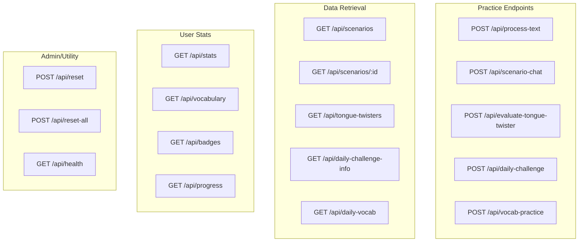

### Endpoint Details

#### 1. `/api/process-text` (POST)
**Purpose:** Free practice conversation with AI

**Request:**
```json
{
  "text": "User's spoken/typed message",
  "context": "Optional conversation context"
}
```

**Response:**
```json
{
  "reply_text": "AI's response",
  "correction": {
    "original": "Incorrect sentence",
    "corrected": "Fixed version",
    "explanation": "Why it was wrong",
    "better_alternative": "More natural way"
  },
  "fluency_score": 8,
  "new_word": {
    "word": "Articulate",
    "definition": "Express clearly",
    "example": "She articulated her vision"
  },
  "new_badges": ["badge_id_1", "badge_id_2"]
}
```

**Backend Flow:**
```mermaid
flowchart LR
    A[Receive text] --> B[Load user history]
    B --> C[Load system prompt]
    C --> D[Build message array]
    D --> E[Call Groq API]
    E --> F[Parse JSON response]
    F --> G[Update word count]
    G --> H[Calculate XP]
    H --> I[Check level up]
    I --> J[Add new vocabulary]
    J --> K[Update streak]
    K --> L[Check badges]
    L --> M[Save user_data.json]
    M --> N[Return response]
```

#### 2. `/api/scenario-chat` (POST)
**Purpose:** Roleplay in specific scenarios

**Request:**
```json
{
  "text": "User response",
  "scenario_id": "job_interview",
  "scenario_context": "Current prompt being attempted"
}
```

**Response:** Same as `/api/process-text` + `scenario_tips`

#### 3. `/api/vocab-practice` (POST)
**Purpose:** Evaluate sentence using a vocabulary word

**Request:**
```json
{
  "word": "Pragmatic",
  "sentence": "We need a pragmatic solution to this problem",
  "definition": "Dealing with things in a practical way"
}
```

**Response:**
```json
{
  "correct_usage": true,
  "score": 9,
  "feedback": "Excellent usage! Very natural.",
  "better_sentence": "Alternative example",
  "common_mistakes": "People often confuse pragmatic with practical...",
  "extra_tip": "Use in business contexts",
  "xp_earned": 15,
  "new_badges": []
}
```

#### 4. `/api/daily-vocab` (GET)
**Purpose:** Get today's 12 vocabulary words

**Response:**
```json
{
  "date": "2026-02-14",
  "total": 12,
  "practiced_count": 5,
  "words": [
    {
      "word": "Articulate",
      "definition": "...",
      "category": "Business",
      "level": "Intermediate",
      "examples": ["...", "..."],
      "usage_tips": "...",
      "synonyms": ["express", "convey"],
      "antonyms": ["mumble"],
      "practiced": true
    }
  ]
}
```

#### 5. `/api/stats` (GET)
**Purpose:** Get comprehensive user statistics

**Response:**
```json
{
  "xp": 2450,
  "level": 8,
  "xp_in_level": 150,
  "xp_for_next_level": 500,
  "words_spoken": 3420,
  "session_count": 45,
  "streak_days": 7,
  "average_accuracy": 7.8,
  "vocabulary_count": 28,
  "badges_count": 6,
  "accuracy_history": [7, 8, 9, 7, 8],
  "skill_scores": {
    "grammar": 8,
    "vocabulary": 7,
    "pronunciation": 6,
    "fluency": 8,
    "confidence": 7
  }
}
```

---

## 🧩 Component Documentation

### Core Components

#### **App.jsx** - Main Application Container
```javascript
// State Management
const [currentPage, setCurrentPage] = useState('dashboard');
const [stats, setStats] = useState(null);
const [selectedScenario, setSelectedScenario] = useState(null);
const [newBadges, setNewBadges] = useState([]);

// Key Functions
- fetchStats(): Loads user statistics from API
- handleBadges(badges): Queues new badge notifications
- navigateTo(page, data): Changes current page
- renderPage(): Routes to appropriate component
```

**Navigation Flow:**
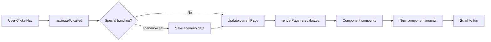

#### **PracticeChat.jsx** - Voice/Text Practice
**Key Features:**
- Dual input mode (voice + text)
- Real-time speech recognition with interim results
- Chat history with corrections display
- Vocabulary word cards
- Text-to-speech for AI responses

**Voice Recognition Pattern:**
```javascript
recognition.onresult = (event) => {
  let interim = '', final = '';
  for (let i = 0; i < event.results.length; i++) {
    if (event.results[i].isFinal) {
      final += event.results[i][0].transcript + ' ';
    } else {
      interim += event.results[i][0].transcript;
    }
  }
  // Update UI with both final and interim
};

recognition.onend = () => {
  const text = finalTranscriptRef.current.trim();
  if (text) sendToAI(text);
};
```

#### **DailyVocab.jsx** - Vocabulary Learning
**Two-View Pattern:**

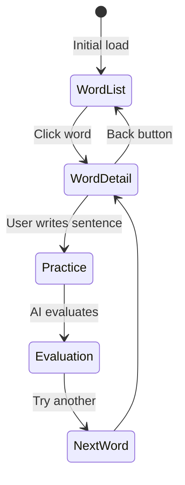

**State Structure:**
```javascript
{
  vocabData: {
    date: "2026-02-14",
    words: [...],
    total: 12,
    practiced_count: 5
  },
  selectedWord: {...} | null,
  practiceInput: "",
  result: {...} | null
}
```

#### **Progress.jsx** - Analytics Dashboard
**Data Visualization:**
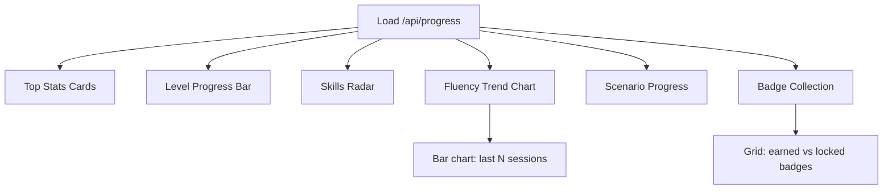

---

## 🎮 Gamification System

### XP Calculation Formula

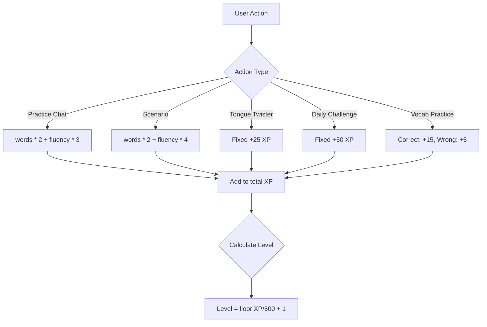

### Level Progression

```python
def calculate_level(xp):
    level = 1
    xp_for_next = 100
    xp_in_level = xp
    
    while xp_in_level >= xp_for_next:
        xp_in_level -= xp_for_next
        level += 1
        xp_for_next = int(100 * (1.5 ** (level - 1)))
    
    return level, xp_in_level, xp_for_next
```

**Level Curve:**
- Level 1→2: 100 XP
- Level 2→3: 150 XP
- Level 3→4: 225 XP
- Level N→N+1: `100 * 1.5^(N-1)` XP

### Badge System

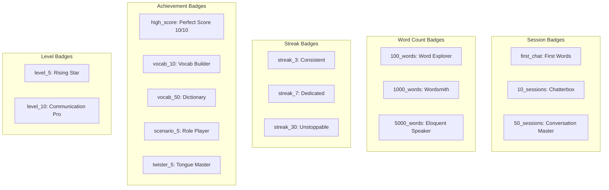

**Badge Award Logic:**
```python
def check_and_award_badges(user_data):
    new_badges = []
    earned_ids = [b["id"] for b in user_data.get("badges", [])]
    
    # Session-based
    if user_data["session_count"] >= 10 and "10_sessions" not in earned_ids:
        new_badges.append({"id": "10_sessions", "name": "Chatterbox", ...})
    
    # Streak-based
    if user_data["streak_days"] >= 7 and "streak_7" not in earned_ids:
        new_badges.append({"id": "streak_7", "name": "Dedicated", ...})
    
    # ... more checks
    
    return new_badges
```

### Streak Tracking

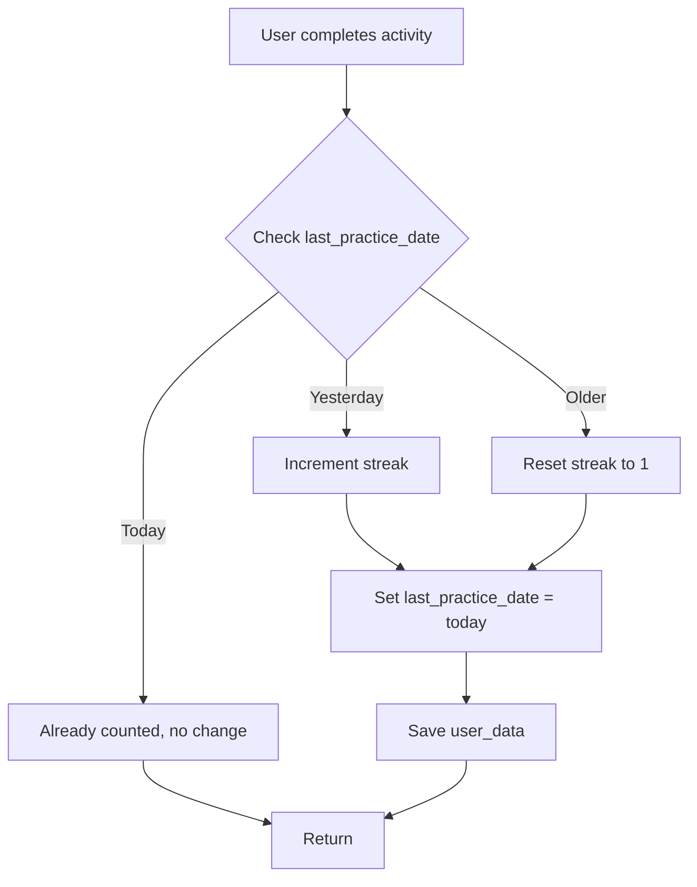

---

## 🤖 AI Integration

### Groq API Configuration

```python
client = Groq(api_key=os.getenv("GROQ_API_KEY"))

chat_completion = client.chat.completions.create(
    messages=[...],
    model="llama-3.3-70b-versatile",
    temperature=0.7,
    max_tokens=1024,
    response_format={"type": "json_object"}  # Forces JSON output
)
```

### System Prompt Architecture

**Loaded from `system_prompt.txt`:**
```
You are Miss Nova, an expert AI English communication tutor...

ALWAYS respond in this exact JSON format:
{
  "reply_text": "Your conversational response",
  "correction": {...},
  "fluency_score": 1-10,
  "new_word": {...}
}
```

### Prompt Engineering Patterns

#### Pattern 1: Free Practice
```mermaid
graph LR
    A[System Prompt] --> B[Conversation History]
    B --> C[User Message]
    C --> D[Groq LLM]
    D --> E[JSON Response]
    E --> F[Parse & Validate]
```

#### Pattern 2: Scenario Roleplay
```python
# Modified system prompt for scenarios
f"""
You are Miss Nova in a roleplay scenario.
SCENARIO: {scenario['title']}
YOUR ROLE: {scenario['ai_role']}
CONTEXT: {scenario_context}

The user is practicing: {scenario['description']}
Respond in character while providing feedback.
"""
```

#### Pattern 3: Vocabulary Evaluation
```python
f"""
You are a vocabulary coach evaluating word usage.
WORD: "{word}"
DEFINITION: "{definition}"
LEARNER'S SENTENCE: "{sentence}"

Evaluate correctness and naturalness.
Provide specific feedback on usage.
"""
```

### Error Handling & Fallbacks

```mermaid
flowchart TD
    A[API Call] --> B{Success?}
    B -->|Yes| C[Parse JSON]
    C --> D{Valid JSON?}
    D -->|Yes| E[Extract fields]
    D -->|No| F[Try regex extraction]
    
    B -->|No| G{Error Type}
    G -->|Rate limit| H[Return cached response]
    G -->|Network| I[Retry with backoff]
    G -->|Auth| J[Return error to user]
    
    F --> K{Found JSON?}
    K -->|Yes| E
    K -->|No| L[Log error + default response]
    
    E --> M[Validate fields]
    M --> N[Return to frontend]
```

---

## 📁 File Structure

```
voice_tutor_app/
│
├── backend/
│   ├── main.py                 # FastAPI application (1053 lines)
│   ├── user_data.json         # User state persistence
│   ├── system_prompt.txt      # AI system instructions
│   ├── requirements.txt       # Python dependencies
│   ├── venv/                  # Virtual environment
│   └── dist/                  # Built frontend (served by FastAPI)
│
├── frontend/
│   ├── src/
│   │   ├── main.jsx           # React entry point
│   │   ├── App.jsx            # Root component & routing
│   │   ├── index.css          # Global styles + design system
│   │   │
│   │   └── components/
│   │       ├── Sidebar.jsx            # Desktop navigation
│   │       ├── MobileNav.jsx          # Mobile navigation
│   │       ├── BadgeToast.jsx         # Badge notifications
│   │       ├── Dashboard.jsx          # Landing page
│   │       ├── PracticeChat.jsx       # Free practice mode
│   │       ├── Scenarios.jsx          # Scenario browser
│   │       ├── ScenarioChat.jsx       # Scenario practice
│   │       ├── TongueTwisters.jsx     # Pronunciation practice
│   │       ├── DailyChallenge.jsx     # Daily challenges
│   │       ├── DailyVocab.jsx         # Vocabulary learning
│   │       ├── VocabularyBank.jsx     # Word collection
│   │       └── Progress.jsx           # Analytics dashboard
│   │
│   ├── index.html             # HTML entry point
│   ├── package.json           # npm dependencies
│   ├── vite.config.js         # Vite configuration
│   ├── tailwind.config.js     # Tailwind configuration
│   └── dist/                  # Built production files
│
├── DOCUMENTATION.md           # This file
└── .env                       # Environment variables (GROQ_API_KEY)
```

### Component Size & Complexity

```mermaid
graph LR
    subgraph Small["Small < 300 lines"]
        A[Sidebar.jsx - 152]
        B[MobileNav.jsx - 64]
        C[BadgeToast.jsx - 70]
    end
    
    subgraph Medium["Medium 300-500 lines"]
        D[Dashboard.jsx - 215]
        E[Progress.jsx - 14824]
        F[DailyChallenge.jsx - 18000]
    end
    
    subgraph Large["Large > 500 lines"]
        G[PracticeChat.jsx - 381]
        H[DailyVocab.jsx - 20000]
    end
    
    subgraph Backend["Backend"]
        I[main.py - 1053]
    end
```

---

## 🚀 Deployment & Usage

### Starting the Application

#### Backend
```bash
cd backend
source venv/bin/activate
python main.py
# Runs on http://localhost:8000
```

#### Frontend (Development)
```bash
cd frontend
npm run dev
# Runs on http://localhost:5173
# Proxies API calls to :8000
```

#### Frontend (Production)
```bash
cd frontend
npm run build
# Outputs to dist/
# Backend serves from dist/ at root path
```

### Environment Setup

**Required `.env` file:**
```bash
GROQ_API_KEY=gsk_...your_api_key_here
```

### Port Configuration

```mermaid
graph LR
    A[User Browser] -->|Visit| B[localhost:5173]
    B -->|API calls /api/*| C[Vite Proxy]
    C -->|Forward to| D[localhost:8000]
    D -->|FastAPI| E[Backend]
    E -->|Groq API| F[External AI]
    
    style B fill:#ec4899
    style D fill:#8b5cf6
    style F fill:#f59e0b
```

---

## 🔐 Security Considerations

1. **API Key Protection:** `.env` file excluded from git
2. **CORS:** Configured for `localhost:5173` in development
3. **Input Validation:** Pydantic models validate all API inputs
4. **Rate Limiting:** Handled by Groq API (external)
5. **XSS Prevention:** React automatically escapes content

---

## 🎯 Key Features Summary

### Feature Completion Matrix

| Feature | Backend | Frontend | AI Integration | Gamification |
|---------|---------|----------|----------------|--------------|
| Free Practice | ✅ | ✅ | ✅ | ✅ |
| Scenarios (8) | ✅ | ✅ | ✅ | ✅ |
| Tongue Twisters (15) | ✅ | ✅ | ✅ | ✅ |
| Daily Challenge | ✅ | ✅ | ✅ | ✅ |
| Daily Vocab (40+) | ✅ | ✅ | ✅ | ✅ |
| Vocabulary Bank | ✅ | ✅ | - | ✅ |
| Progress Tracking | ✅ | ✅ | - | ✅ |
| XP & Levels | ✅ | ✅ | - | ✅ |
| Badges (16) | ✅ | ✅ | - | ✅ |
| Streaks | ✅ | ✅ | - | ✅ |

### User Journey Map

```mermaid
journey
    title Communication Learning Journey
    section Day 1
      Create account: 5: User
      Try free practice: 4: User
      Earn first badge: 5: User
      Learn 3 new words: 4: User
    section Day 2-7
      Daily challenge: 4: User
      Practice scenario: 5: User
      Learn vocabulary: 4: User
      Build 7-day streak: 5: User
    section Week 2+
      Advanced scenarios: 5: User
      Pronunciation mastery: 4: User
      Level up to 5: 5: User
      Review progress: 5: User
```

---

## 📊 Performance Characteristics

### API Response Times
- `/api/stats`: ~10ms (local JSON read)
- `/api/daily-vocab`: ~5ms (deterministic selection)
- `/api/process-text`: ~800-2000ms (Groq API latency)
- `/api/vocab-practice`: ~500-1500ms (Groq API)

### Bundle Sizes
- Frontend JS: ~291 KB (gzipped: 80 KB)
- Frontend CSS: ~15 KB (gzipped: 4 KB)
- Total initial load: ~296 KB compressed

---

## 🛠️ Future Enhancement Ideas

1. **Persistent Database:** Replace JSON with PostgreSQL/MongoDB
2. **Multi-user Support:** Add authentication & user accounts
3. **Advanced Analytics:** Track improvement over time
4. **Mobile App:** React Native version
5. **Offline Mode:** Service worker + local storage
6. **Community Features:** Leaderboards, shared scenarios
7. **Video Practice:** Webcam-based presentation training
8. **Accent Training:** Regional accent practice
9. **AI Voice Cloning:** Consistent AI voice persona
10. **Lesson Plans:** Structured curriculum paths

---

## 📖 Glossary

- **XP:** Experience Points earned through activities
- **Fluency Score:** 1-10 rating of language proficiency
- **Streak:** Consecutive days of practice
- **Badge:** Achievement unlocked by meeting criteria
- **Scenario:** Roleplay situation with AI character
- **Tongue Twister:** Pronunciation practice phrase
- **Vocab Bank:** Collection of learned words
- **Miss Nova:** AI tutor persona

---

**Last Updated:** 2026-02-14  
**Version:** 1.0.0  
**Maintainer:** Communication Learning Platform Team
