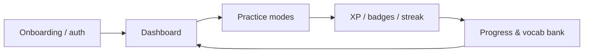

# 01 — Overview

**Miss Nova** is a full-stack AI tutor for English communication. Learners practice speaking and writing with an AI persona, get corrections and fluency scores, and unlock XP, levels, streaks, and badges.

Speech recognition and playback run in the browser (Web Speech API). Language coaching and evaluation run on the backend via the **Groq** API (`llama-3.3-70b-versatile`).

→ Deeper system view: [Architecture](./02-architecture.md)  
→ Run it locally: [Developer Guide](./06-developer-guide.md)

---

## Core features

| Feature | What it does |
|---------|----------------|
| Free Practice Chat | Open-ended conversation with grammar correction, fluency score (1–10), vocab suggestions, TTS |
| Scenario Roleplay | Pre-built situations (job interview, meeting, etc.) with in-character AI feedback |
| Tongue Twisters | Pronunciation drills (Easy/Medium/Hard) graded by AI |
| Daily Challenge | Rotating daily speaking/writing prompts with AI evaluation |
| Daily Vocabulary | Curated words per day; write a sentence; AI scores usage |
| Vocabulary Bank | Persistent bank of learned words with mastery |
| Progress Dashboard | Skill radar, accuracy history, weekly XP, badges |
| Gamification | XP, levels, badges, streaks (with freeze), multipliers |
| Onboarding | Guest/signup flow, level & goals, language preference |
| Notifications | Streak / practice reminders (client-side) |

---

## Advanced tools

Mapped to pages in `frontend/src/App.jsx`:

| Page id | Component | Purpose |
|---------|-----------|---------|
| `translate` | `TranslateInput` | Non-English input → English + tips |
| `bluf-generator` | `BLUFGenerator` | Condense text into Bottom-Line-Up-Front bullets |
| `tone-calibrator` | `ToneCalibrator` | Tone/clarity for different audiences |
| `listening-simulator` | `ListeningSimulator` | Empathy / de-escalation roleplay |
| `filler-tracker` | `FillerTracker` | Detect and reduce filler words |
| `placement-test` | `PlacementTest` | Level placement |
| `grammar-lessons` | `GrammarLessons` | Grammar content + practice |
| `idiom-engine` | `IdiomEngine` | Daily idioms + practice |
| `srs-review` | `SRSReview` | Spaced repetition review queue |
| `writing-workshop` | `WritingWorkshop` | Writing prompts + AI feedback |
| `conversation-replay` | `ConversationReplay` | Replay saved practice sessions |

Also: multi-language learning target (10 languages), daily goals, and a leaderboard (backend may serve mock/partial ranking data).

---

## User journey

1. **Onboard** — guest or account; pick level, goals, language.  
2. **Practice** — chat, scenarios, vocab, tools.  
3. **Earn** — XP, badges, streak updates after successful activities.  
4. **Review** — Progress page, vocabulary bank, conversation replay.
