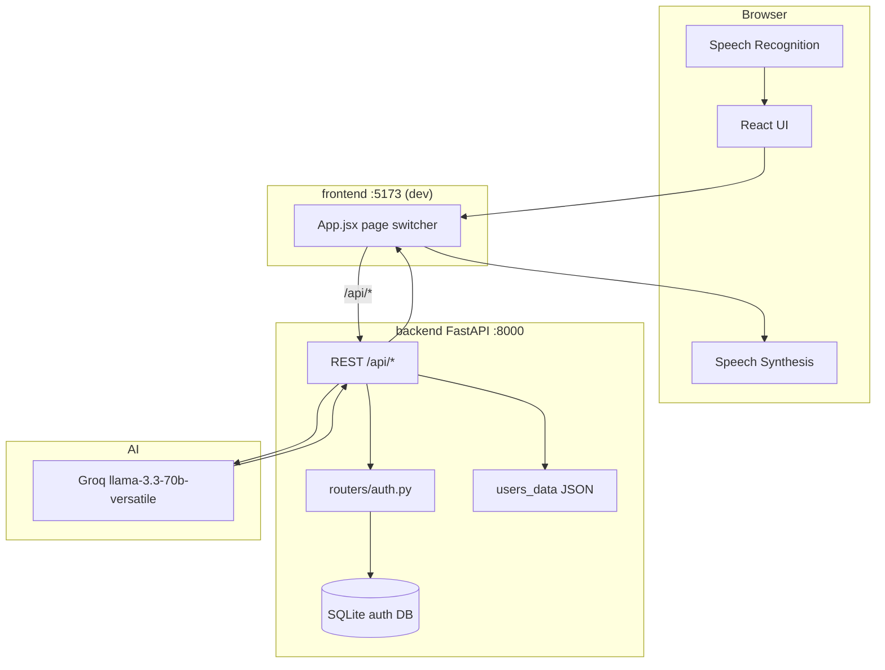

# 02 — Architecture

## Monorepo layout

```
MissNova/
├── frontend/          # React 19 + Vite + Tailwind 4
├── backend/           # FastAPI app, auth router, models, content
├── api/index.py       # Vercel Python entry (imports backend.main:app)
├── vercel.json        # Static frontend + Python API routes
├── system_prompt.txt  # Tutor system prompt (repo root)
└── docs/              # This handbook
```

---

## High-level system



---

## Voice practice sequence

```mermaid
sequenceDiagram
  participant U as User
  participant B as Browser
  participant R as React
  participant F as FastAPI
  participant G as Groq

  U->>B: Speak
  B->>R: Transcript (Web Speech)
  R->>F: POST /api/process-text + Bearer token
  F->>F: Load users_data/{user_id}.json
  F->>G: Chat completion (JSON mode)
  G-->>F: reply, correction, fluency, new_word
  F->>F: XP, streak, badges; save JSON
  F-->>R: Response JSON
  R->>B: speechSynthesis.speak(reply)
  B-->>U: AI voice
```

---

## Dual persistence

| Concern | Store | Location / config |
|---------|--------|-------------------|
| **Auth / user accounts** | SQLAlchemy + SQLite (or Postgres) | `DATABASE_URL` (default `sqlite:///./voice_tutor.db`) — see `backend/models.py` |
| **Learning progress** | Per-user JSON files | `USERS_DATA_DIR` (default `backend/users_data/{user_id}.json`) — see `backend/main.py` |

Progress is keyed by user id parsed from the `Authorization: Bearer` token (`get_user_id_from_request`). Unauthenticated requests fall back to user id `default`.

On **Vercel**, `api/index.py` sets writable paths under `/tmp` before importing the app:

- `DATABASE_URL=sqlite:////tmp/voice_tutor.db` (if unset)
- `USERS_DATA_DIR=/tmp/users_data`
- `AUTH_DATA_FILE=/tmp/auth_data.json`

`/tmp` is **ephemeral** (cold starts wipe data). Use a hosted Postgres `DATABASE_URL` for durable auth; progress JSON on Vercel remains fragile without an external store.

---

## Auth mental model

1. Signup / login / guest-login via `/api/auth/*` (`backend/routers/auth.py`).
2. Client stores token in `localStorage` key `voice_tutor_auth` (`accessToken`, expiry).
3. Token format: `{user_id}:{username}:{random_hex}` (or guest-style tokens).
4. On app load, frontend may call `POST /api/auth/refresh` to extend the session.
5. API calls attach `Authorization: Bearer <token>` (`authFetch` / axios config).

**Limitation:** Auth uses simplified hashing/token schemes suitable for demos; treat as non-production-grade security.

---

## CORS

`backend/main.py` allows explicit origins (not `*`) with credentials, including:

- `https://miss-nova.vercel.app`
- related Vercel project URL(s)
- `http://localhost:5173` / `http://localhost:3000`

---

## Deploy shape (Vercel)

| Request | Handler |
|---------|---------|
| `/api/*` | Python serverless (`api/index.py` → FastAPI `app`) |
| Static assets | CDN from `frontend/dist` |
| SPA routes | Fallback to `index.html` |

Details: [07-deployment](./07-deployment.md).

---

## Known architectural debt

- **`backend/main.py` is a monolith** (~3900 lines): routes, content catalogs, and game logic together.
- **`backend/gamification.py` is not imported** by the live FastAPI path; level/XP for API responses use helpers **inside** `main.py`.
- **Ephemeral Vercel storage** for SQLite + progress JSON unless you add external persistence.
